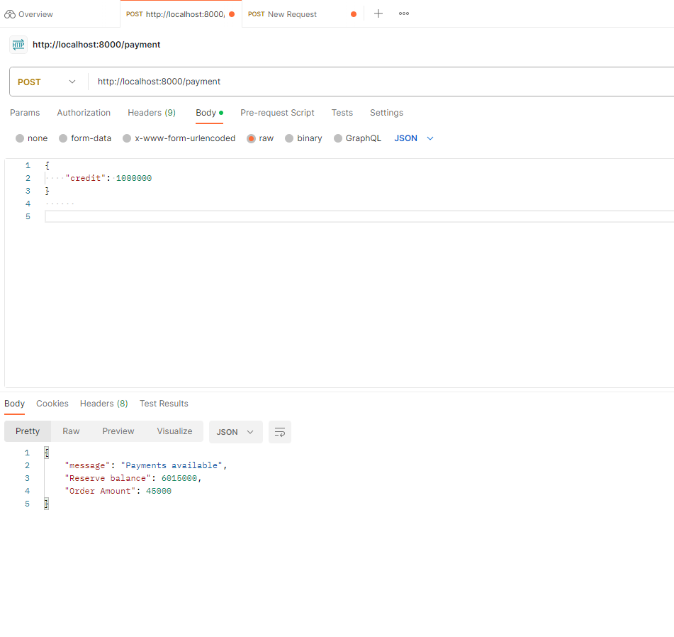

## 1. 본 PR이 우리 팀의 웹 서비스 제품성에 어떠한 기여를 하였고,   사용자에게 어떠한 기대효과를 전달하는지 작성해주세요.

- 내 PR이 제품 내 어떠한 기능적인 배경/전후맥락 가운데 개발되었나요?

  고객이 제품을 구매할 경우 백엔드에서 일어날 결제시스템을 개발하였습니다. 현재 우리가 개발하고 있는 제품의 단계는 테스트에 가깝기때문에 mvp를 최우선으로 생각하였습니다. 결제 같은 경우 현재 수 많은 웹사이트들이 사용하고 있는 네이버페이 같은 외주 결제 시스템을 생각하였으나, 실제로 운영되는 웹사이트가 아니기에 간단하게 데이터베이스에 지갑을 생성하여, 포인트로 결제를 가능할 수 있도록 만들었습니다.

- 내 PR이 Merge 됨으로써 유저에게 전달되는 편익/기대효과는 무엇일까요?

  포인트를 충전하고 제품을 구매할 수 있다.

 

## 2. 이 브랜치에서 어떤 내용을 개발했는지 큰 제목과 상세 내역을 적어주세요.

결제를 완료한 구매건들은 결제 status를 생성하여서 중복으로 구매할 수 없게 만들었습니다.

 

## 3. 개발한 화면을 캡쳐해서 첨부 해 주세요.

 

- (drag & drop 또는 첨부파일 추가)

 

## 4. 이 브랜치에서 개발하면서 느꼇던 개발 성장포인트를 적어주세요.

- (예시) 새로운 배열메서드 filter를 쓸 수 있게됐습니다.
- (예시) 상수데이터와 map 메서드로 반복되는 UI를 그릴 수 있게 됐습니다.
- (예시) fetch함수를 어떻게 쓰는지 알게됐습니다.
- (예시) 계산된 속성명 (computed property)을 쓰긴했는데 어떻게 돌아가는지 이해가 잘 안되서
  블로그에 정리해봐야겠습니다.
- (예시) 화살표 함수(arrow-function) 어떤 코드를 언제 생략할 수있는지 완벽 이해했습니다.
- (예시) 구조분해할당(Destructuring assignment)을 써보니 가독성도, 유지보수도 편할것같습니다.
   
